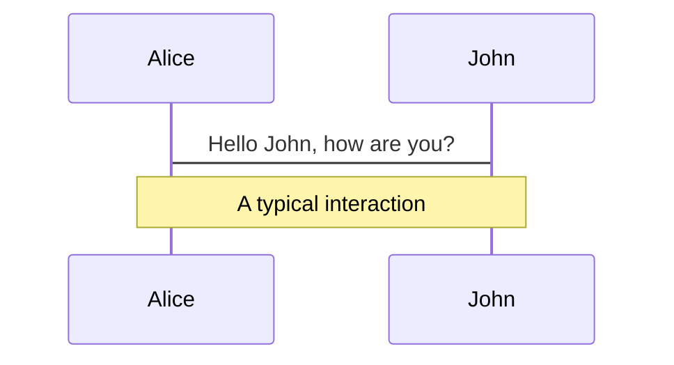
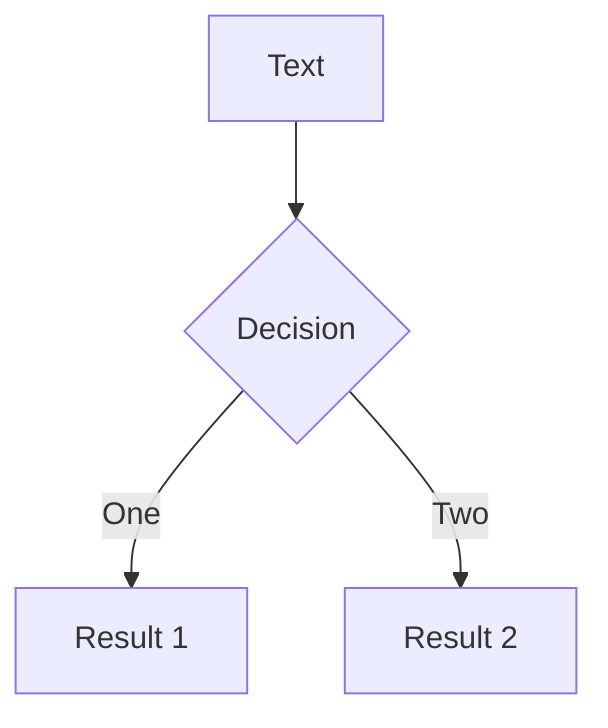
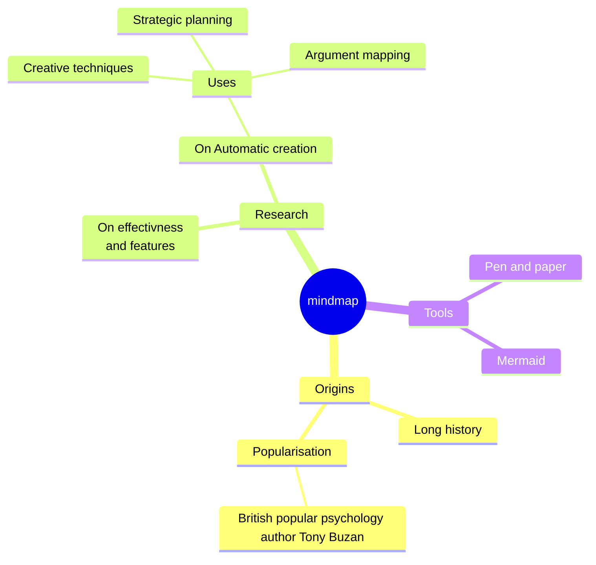
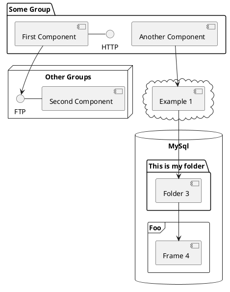

# Deep CNNs for Galaxy Cluster Mass Estimation

Inspecting deep convolutional neural networks (CNNs) for galaxy cluster mass estimation from eFEDS simulation data.

<!-- Supervisors: Dr. Sven Krippendorf, Prof. Jochen Weller -->

<div class="pt-12">
  <span @click="$slidev.nav.next" class="px-2 py-1 rounded cursor-pointer" hover="bg-white bg-opacity-10">
    Press Space for next page <carbon:arrow-right class="inline"/>
  </span>
</div>

<div class="abs-br m-6 flex gap-2">
  <a href="https://github.com/HiaslHoam/cluster_masses_dl_slidev" target="_blank" alt="GitHub" title="Open in GitHub"
    class="text-xl slidev-icon-btn opacity-50 !border-none !hover:text-white">
    <carbon-logo-github />
  </a>
</div>

<!--
The last comment block of each slide will be treated as slide notes. It will be visible and editable in Presenter Mode along with the slide. [Read more in the docs](https://sli.dev/guide/syntax.html#notes)
-->

---
transition: none
---

# The Basis of my Thesis

Krippendorf et al. (2023)

<div class="grid grid-cols-2 justify-center justify-items-center items-start">
<div>  
<a href="https://arxiv.org/pdf/2305.00016.pdf" target="_blank">
  
</a>
</div>
<div class="mt-5 list">

* Basic CNNs are capable of estimating galaxy cluster masses
* Trained with data from eFEDS simulations
* 7946 galaxy clusters with mass range <br/> $13 < \log{(M_{500}^{\text{true}}/M_{\odot})} < 15$ <br/> and redshift range $0.01 < z < 1.5$

</div>
</div>

<style>
  a {
    border-style: none !important;
  }

  a:hover {
    border-style: none !important;
  }

  .list li{
    margin-bottom: 1.8rem !important;
  }
</style>

---

# The Basis of my Thesis

Krippendorf et al. (2023)

<div class="grid grid-cols-2 justify-center justify-items-center items-center">
<div>
  
</div>
<div class="mt-5 list ml-5">

* Cluster image input 50x50 pixels with 10 frequency bands $0.25keV < \nu < 2.3keV$
* Redshift data is added to the dense network for distance information
* Optimized training parameters for the task

</div>
</div>

<style>

  .list li{
    margin-bottom: 1.8rem !important;
  }
</style>

---

# Goals
<div class="grid grid-cols-2 justify-center justify-items-center items-start">


<div class="list">

* Are deep neural networks capable of more accurate predictions?
* Which deep architectures are suitable for galaxy cluster mass estimation?
* Can we build a pipeline for efficient architecture testing and parameter optimization?
</div>

<div>
  

<p class="text-sm text-gray-400"> 

VGG vs ResNet Architecture

</p>
</div>

</div>

<style>

  .list li{
    margin-bottom: 1.8rem !important;
  }
</style>
---
transition: none
---

# Deep Architectures:

<div class="grid grid-cols-3 justify-items-center">
<div class="active">
<h2>VGG</h2>
<br/>
<ul>
<li>
<b>Published</b>: Simonyan and Zisserman (2015)
</li>
<li>
<b>Parameters</b>:

$15 \cdot 10^6 \sim 21 \cdot 10^6$
</li>
<li>
<b>Features</b>:

* One of the first successful deep CNN model
* 16 and 19 layer model
</li>
</ul>
</div>
<div class="not-active">
<h2>ResNet</h2>
<br/>
<ul>
<li>
<b>Published</b>: He et al. (2016)
</li>
<li>
<b>Parameters</b>:

$32 \cdot 10^6 \sim 67 \cdot 10^6$
</li>
<li>
<b>Features</b>:

* Usage of residual blocks improved accuracy massively
* Many different layerdepths available
</li>
</ul>
</div>
<div class="not-active">
<h2>EfficientNet</h2>
<br/>
<ul>
<li>
<b>Published</b>: Tan and Le (2020)
</li>
<li>
<b>Parameters</b>:

$76 \cdot 10^6$
</li>
<li>
<b>Features</b>:

* AI powered parameter and architecture optimization
</li>
</ul>
</div>

</div>

<style>
.not-active {
  color: #adadad;
}
</style>

---
transition: none
---
# Deep Architectures:

<div class="grid grid-cols-3 justify-items-center">
<div class="not-active">
<h2>VGG</h2>
<br/>
<ul>
<li>
<b>Published</b>: Simonyan and Zisserman (2015)
</li>
<li>
<b>Parameters</b>:

$15 \cdot 10^6 \sim 21 \cdot 10^6$
</li>
<li>
<b>Features</b>:

* One of the first successful deep CNN model
* 16 and 19 layer model
</li>
</ul>
</div>
<div class="active">
<h2>ResNet</h2>
<br/>
<ul>
<li>
<b>Published</b>: He et al. (2016)
</li>
<li>
<b>Parameters</b>:

$32 \cdot 10^6 \sim 67 \cdot 10^6$
</li>
<li>
<b>Features</b>:

* Usage of residual blocks improved accuracy massively
* Many different layerdepths available
</li>
</ul>
</div>
<div class="not-active">
<h2>EfficientNet</h2>
<br/>
<ul>
<li>
<b>Published</b>: Tan and Le (2020)
</li>
<li>
<b>Parameters</b>:

$76 \cdot 10^6$
</li>
<li>
<b>Features</b>:

* AI powered parameter and architecture optimization
</li>
</ul>
</div>

</div>

<style>
.not-active {
  color: #adadad;
}
</style>


---


# Deep Architectures:

<div class="grid grid-cols-3 justify-items-center">
<div class="not-active">
<h2>VGG</h2>
<br/>
<ul>
<li>
<b>Published</b>: Simonyan and Zisserman (2015)
</li>
<li>
<b>Parameters</b>:

$15 \cdot 10^6 \sim 21 \cdot 10^6$
</li>
<li>
<b>Features</b>:

* One of the first successful deep CNN model
* 16 and 19 layer model
</li>
</ul>
</div>
<div class="not-active">
<h2>ResNet</h2>
<br/>
<ul>
<li>
<b>Published</b>: He et al. (2016)
</li>
<li>
<b>Parameters</b>:

$32 \cdot 10^6 \sim 67 \cdot 10^6$
</li>
<li>
<b>Features</b>:

* Usage of residual blocks improved accuracy massively
* Many different layerdepths available
</li>
</ul>
</div>
<div class="active">
<h2>EfficientNet</h2>
<br/>
<ul>
<li>
<b>Published</b>: Tan and Le (2020)
</li>
<li>
<b>Parameters</b>:

$76 \cdot 10^6$
</li>
<li>
<b>Features</b>:

* AI powered parameter and architecture optimization
</li>
</ul>
</div>

</div>

<style>
.not-active {
  color: #adadad;
}
</style>


---


# My Training Pipeline
<div class="grid cols-1 justify-center">
<div>

</div>
</div>
---
layout: default
---

# Results: Baseline CNN


---
transition: slide-up
level: 2
---

# Navigation

Hover on the bottom-left corner to see the navigation's controls panel, [learn more](https://sli.dev/guide/navigation.html)

## Keyboard Shortcuts

|     |     |
| --- | --- |
| <kbd>right</kbd> / <kbd>space</kbd>| next animation or slide |
| <kbd>left</kbd>  / <kbd>shift</kbd><kbd>space</kbd> | previous animation or slide |
| <kbd>up</kbd> | previous slide |
| <kbd>down</kbd> | next slide |

<!-- https://sli.dev/guide/animations.html#click-animations -->

<p v-after class="absolute bottom-23 left-45 opacity-30 transform -rotate-10">Here!</p>

---
layout: image-right
image: https://source.unsplash.com/collection/94734566/1920x1080
---

# Code

Use code snippets and get the highlighting directly![^1]

```ts {all|2|1-6|9|all}
interface User {
  id: number
  firstName: string
  lastName: string
  role: string
}

function updateUser(id: number, update: User) {
  const user = getUser(id)
  const newUser = { ...user, ...update }
  saveUser(id, newUser)
}
```

<arrow v-click="[3, 4]" x1="400" y1="420" x2="230" y2="330" color="#564" width="3" arrowSize="1" />

[^1]: [Learn More](https://sli.dev/guide/syntax.html#line-highlighting)

<style>
.footnotes-sep {
  @apply mt-20 opacity-10;
}
.footnotes {
  @apply text-sm opacity-75;
}
.footnote-backref {
  display: none;
}
</style>

---

# Components

<div grid="~ cols-2 gap-4">
<div>

You can use Vue components directly inside your slides.

We have provided a few built-in components like `<Tweet/>` and `<Youtube/>` that you can use directly. And adding your custom components is also super easy.

```html
<Counter :count="10" />
```

<!-- ./components/Counter.vue -->
<Counter :count="10" m="t-4" />

Check out [the guides](https://sli.dev/builtin/components.html) for more.

</div>
<div>

```html
<Tweet id="1390115482657726468" />
```

<Tweet id="1390115482657726468" scale="0.65" />

</div>
</div>

<!--
Presenter note with **bold**, *italic*, and ~~striked~~ text.

Also, HTML elements are valid:
<div class="flex w-full">
  <span style="flex-grow: 1;">Left content</span>
  <span>Right content</span>
</div>
-->


---
class: px-20
---

# Themes

Slidev comes with powerful theming support. Themes can provide styles, layouts, components, or even configurations for tools. Switching between themes by just **one edit** in your frontmatter:

<div grid="~ cols-2 gap-2" m="-t-2">

```yaml
---
theme: default
---
```

```yaml
---
theme: seriph
---
```


</div>

Read more about [How to use a theme](https://sli.dev/themes/use.html) and
check out the [Awesome Themes Gallery](https://sli.dev/themes/gallery.html).

---
preload: false
---

# Animations

Animations are powered by [@vueuse/motion](https://motion.vueuse.org/).

```html
<div
  v-motion
  :initial="{ x: -80 }"
  :enter="{ x: 0 }">
  Slidev
</div>
```

<div class="w-60 relative mt-6">
  <div class="relative w-40 h-40">
    
    
    
  </div>

  <div
    class="text-5xl absolute top-14 left-40 text-[#2B90B6] -z-1"
    v-motion
    :initial="{ x: -80, opacity: 0}"
    :enter="{ x: 0, opacity: 1, transition: { delay: 2000, duration: 1000 } }">
    Slidev
  </div>
</div>

<!-- vue script setup scripts can be directly used in markdown, and will only affects current page -->
<script setup lang="ts">
const final = {
  x: 0,
  y: 0,
  rotate: 0,
  scale: 1,
  transition: {
    type: 'spring',
    damping: 10,
    stiffness: 20,
    mass: 2
  }
}
</script>

<div
  v-motion
  :initial="{ x:35, y: 40, opacity: 0}"
  :enter="{ y: 0, opacity: 1, transition: { delay: 3500 } }">

[Learn More](https://sli.dev/guide/animations.html#motion)

</div>

---

# LaTeX

LaTeX is supported out-of-box powered by [KaTeX](https://katex.org/).

<br>

Inline $\sqrt{3x-1}+(1+x)^2$

Block
$$ {1|3|all}
\begin{array}{c}

\nabla \times \vec{\mathbf{B}} -\, \frac1c\, \frac{\partial\vec{\mathbf{E}}}{\partial t} &
= \frac{4\pi}{c}\vec{\mathbf{j}}    \nabla \cdot \vec{\mathbf{E}} & = 4 \pi \rho \\

\nabla \times \vec{\mathbf{E}}\, +\, \frac1c\, \frac{\partial\vec{\mathbf{B}}}{\partial t} & = \vec{\mathbf{0}} \\

\nabla \cdot \vec{\mathbf{B}} & = 0

\end{array}
$$

<br>

[Learn more](https://sli.dev/guide/syntax#latex)

---

# Diagrams

You can create diagrams / graphs from textual descriptions, directly in your Markdown.

<div class="grid grid-cols-4 gap-5 pt-4 -mb-6">









</div>

[Learn More](https://sli.dev/guide/syntax.html#diagrams)

---
src: ./pages/multiple-entries.md
hide: false
---

---
layout: center
class: text-center
---

# Learn More

[Documentations](https://sli.dev) · [GitHub](https://github.com/slidevjs/slidev) · [Showcases](https://sli.dev/showcases.html)
